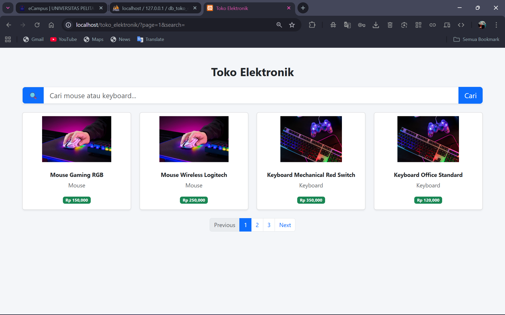
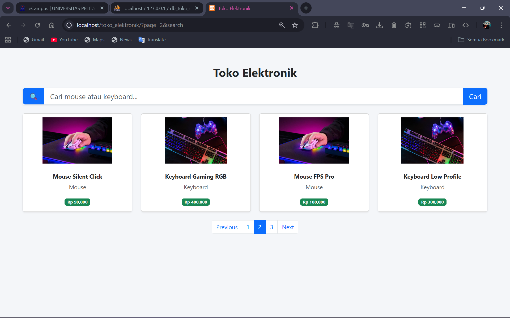
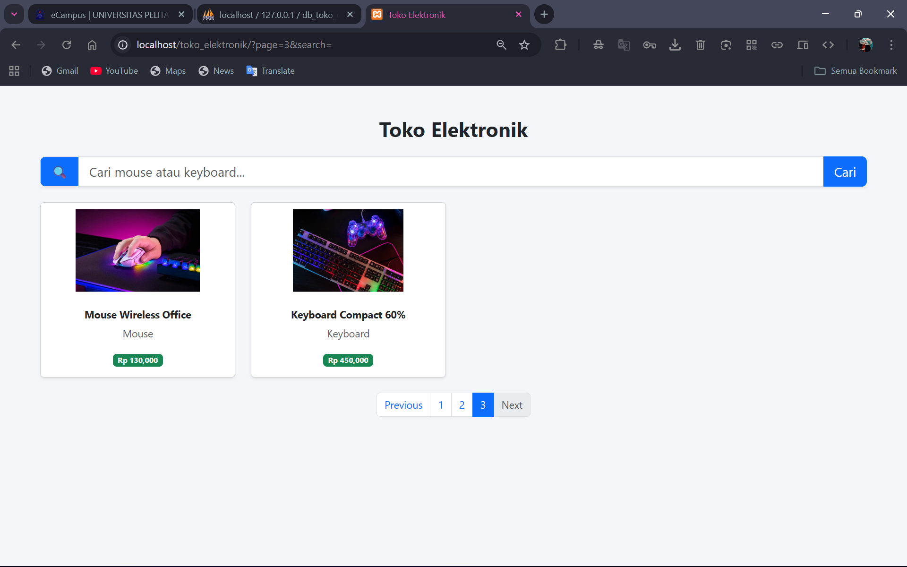
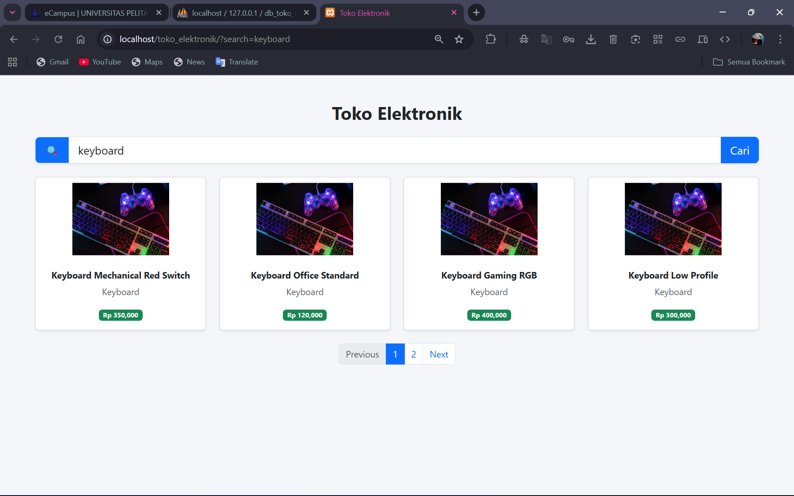
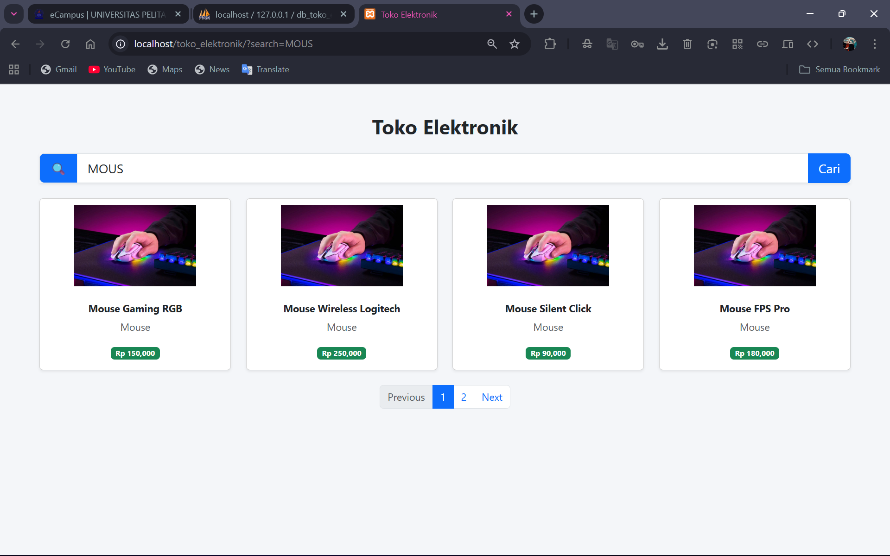

# 🖥️ Toko Elektronik Sederhana (PHP & MySQL)

Project ini merupakan aplikasi web sederhana berbasis **PHP dan MySQL** yang menampilkan daftar produk elektronik seperti **mouse dan keyboard**. Aplikasi ini dibuat sebagai latihan penerapan konsep **CRUD dasar (Read)**, **pagination**, dan **search** dengan tampilan modern menggunakan **Bootstrap**.

---

## 📌 Fitur Utama
- Menampilkan daftar produk elektronik dalam bentuk card
- Pagination untuk membatasi jumlah data per halaman
- Fitur pencarian produk berdasarkan nama atau kategori
- Tampilan responsif menggunakan Bootstrap 5
- Terhubung dengan database MySQL (phpMyAdmin)

---

## 🗂️ Struktur Folder
```
toko_elektronik/
├── assets/
│ └── img/
├── config/
│ └── database.php
├── index.php
├── style.css
└── README.md
```


---

## 🛠️ Teknologi yang Digunakan
- PHP (Native)
- MySQL
- Bootstrap 5
- HTML & CSS
- XAMPP

---

## ⚙️ Cara Menjalankan Project
1. Clone atau download repository ini
2. Simpan folder project ke dalam ` xampp/htdocs `
3. Jalankan **Apache** dan **MySQL** melalui XAMPP
4. Import database `db_toko_elektronik` melalui phpMyAdmin
5. Akses aplikasi melalui browser:
http://localhost/toko_elektronik


---

## 🔍 Pagination & Search
- Pagination dibuat menggunakan query SQL `LIMIT` dan `OFFSET`
- Search menggunakan metode `GET` dengan klausa `LIKE`
- Pagination tetap berjalan meskipun data difilter melalui pencarian

---

## 🎯 Tujuan Project
Project ini bertujuan untuk memahami:
- Koneksi database menggunakan PHP
- Pengolahan data dari database
- Implementasi pagination
- Penerapan fitur search
- Penggunaan Bootstrap untuk tampilan web

---

## 📚 Catatan
Project ini bersifat **edukatif** dan dikembangkan sebagai bagian dari latihan/praktikum mata kuliah pemrograman web.

---

✨ Feel free untuk mengembangkan fitur tambahan seperti CRUD lengkap, filter kategori, atau sistem login.

---

## 📸 Screenshot
### Pagination



### Search


